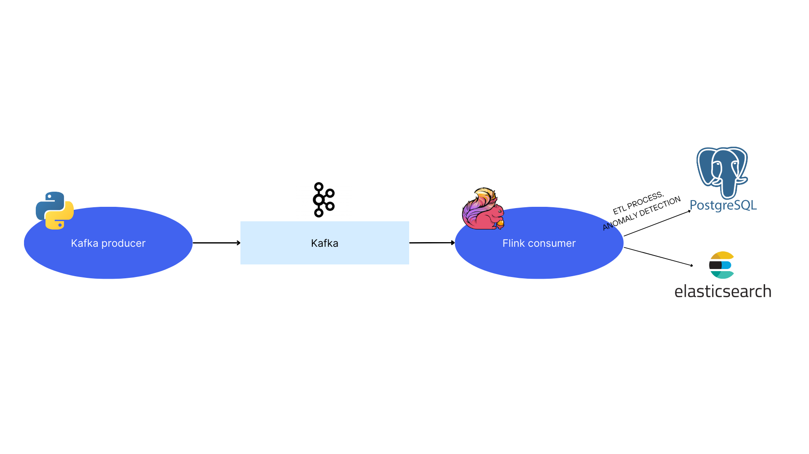
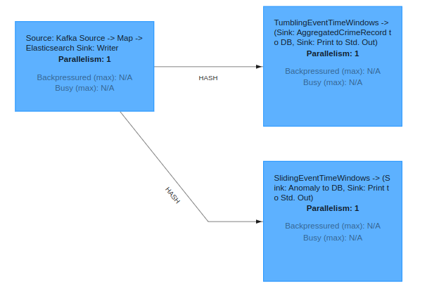
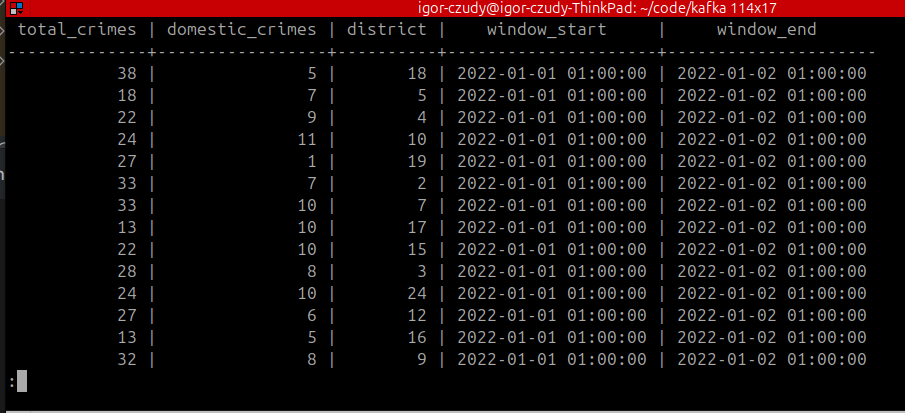
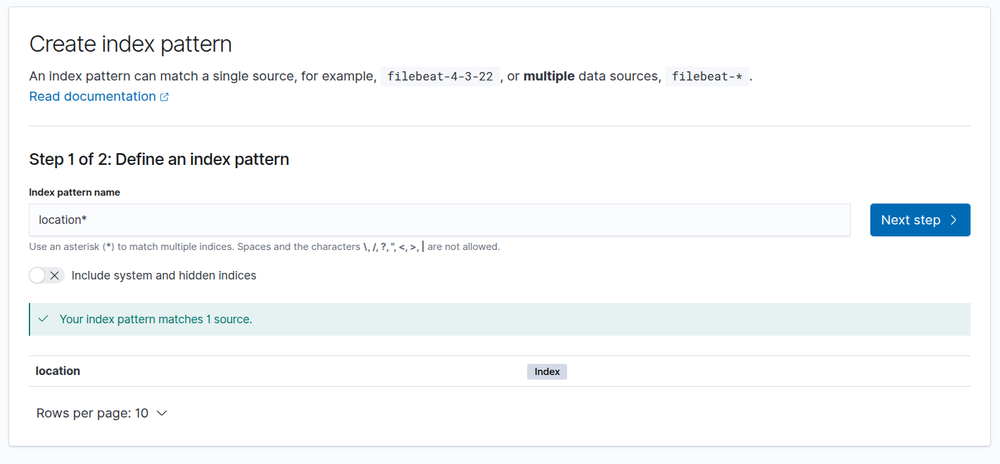
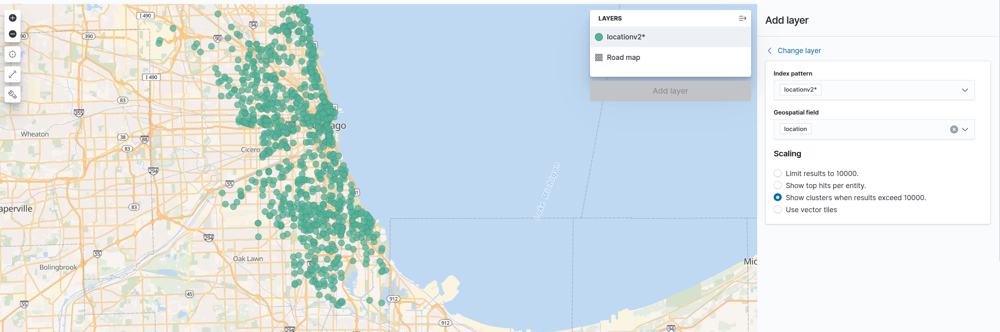

# The Chicago Crime dataset real-time streaming pipeline

A real-time data streaming pipeline using [Apache Kafka](https://kafka.apache.org/), [Flink](https://flink.apache.org/), and [Elasticsearch](https://www.elastic.co/elasticsearch).
It streams and processes the [Chicago Crime dataset](https://www.kaggle.com/datasets/chicago/chicago-crime), performs aggregations, detects anomalies, and stores the results in [PostgreSQL](https://www.postgresql.org/). Elasticsearch is integrated for visualizing crimes on a map.


<div style="text-align: center;">
  
</div>

## Implementation deatails
The source data comes from the [Chicago Crime Dataset](https://www.kaggle.com/datasets/chicago/chicago-crime). A Python script sends this data line by line to the Kafka `crimes` topic, simulating real-life events. The timestamp is not the time the event is sent, but the actual time the incident occurred.

 

A Java Flink application reads this data from the stream and performs two main aggregations:

- A `TumblingEventTimeWindows` of one day, where we aggregate the total number of crimes and the number of domestic crimes per district. These windows do not overlap, so the output of the aggregation is the number of crimes per district for each day.
The aggregated data is stored in PostgreSQL in the`crime_per_district_day` table.
- A `SlidingEventTimeWindows` of 5 hours with a slide of 30 minutes is used for anomaly detection. This window analyzes crimes of the same type that occur very frequently within the same district. Such anomalies—i.e., series of similar crimes—are stored in the`crimes_anomaly` table.


In addition, geographical coordinates are sent downstream to elasticserch sink. This allows further visualization of crimes on the map. 

## Setup:

Clone this repository:
```bash
$git clone https://github.com/IgorCzudy/crimes_in_chicago_streaming
```

Create conda env:
```bash
$conda create -n kafka python=3.10 -y
$conda activate kafka
$pip install -r app/requirements.txt
```


Run docker compose with zookeeper, kafka, postgres, elasticsearch and kibana:
```bash
$sudo docker-compose up --build
```
> [!NOTE]
> To stop docker-compose: ctrl+c and<br>
> `$sudo docker-compose down --volumes --remove-orphans`

Generate kafka massege:

```bash
$python3 app/produceCrime.py
```

> [!NOTE]
> To run this code you need to have flink-1.16.0 installed.<br>
> ```bash
> $wget https://archive.apache.org/dist/flink/flink-1.16.0/
> $tar -xvzf ~/Downloads/flink-1.16.0-bin-scala_2.12.tgz -C .
> ```

Start Flink cluster: 
```bash
./flink-1.16.0/bin/start-cluster.sh
```

Compile Java Flink code with Java 11:
```bash
$mvn clean package -Djava.version=11
```

Run code with Flink 
```bash
$../flink-1.16.0/bin/flink run -c FlinkConsumer.StreamingJob target/ConsumerFlink-1.0-SNAPSHOT.jar 
```

Visit http://localhost:8081/ to see Flink job.  


<div style="text-align: center;">
  
</div>

You can also check if aggragated data are corretly saved in database:

```bash
$sudo docker exec -it <id_of_postgres_container> psql -U admin -d crime_db
```
`\d` to display all tables. You can acess data from table by:
```
select * from crime_per_district_day;
```
Expected result:
<div style="text-align: center;">
  
</div>


Flink streams data father to elastiscearch. You can use then by entering http://localhost:5601/. 

To display points you need to map data to elastiscearch geopints. In dev tools check if data are corretly sended:

`GET location/_search`

Expected output:
```
{
  "took" : 2,
  "timed_out" : false,
  "_shards" : {
    "total" : 1,
    "successful" : 1,
    "skipped" : 0,
    "failed" : 0
  },
  "hits" : {
    "total" : {
      "value" : 10000,
      "relation" : "eq"
    },
    "max_score" : 1.0,
    "hits" : [
      {
        "_index" : "location",
        "_type" : "_doc",
        "_id" : "O6yLEJYBDOb0s27au_RN",
        "_score" : 1.0,
        "_source" : {
          "location" : {
            "lat" : 41.894376732,
            "lon" : -87.631194856
...
```   
Map float points to geopoints:
```      
PUT /locationv2
{
  "mappings": {
    "properties": {
      "location": {
        "type": "geo_point"
      }
    }
  }
}
```
Later create a new index with `locationv2`.
<div style="text-align: center;">
  
</div>

Display crimes on the map. 
<div style="text-align: center;">
  
</div>